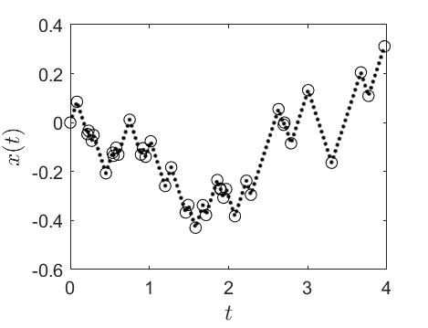
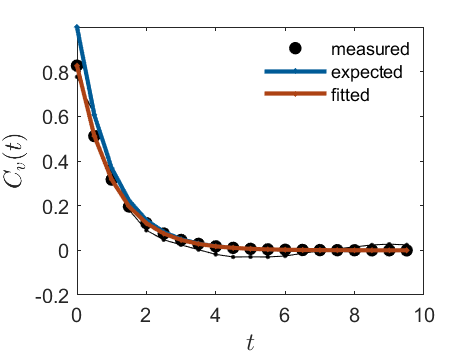

# Poisson-Kac process

**Poisson-Kac (PK) processes are one-dimensional random walks with finite propagation velocity where a particle moves at a constant speed, and reverses its direction of motion
at random moments governed by a Poisson counting process. Instead of using classical parabolic diffusion, these models are based on hyperbolic equations, 
meaning they capture physically realistic finite-speed dynamics and relaxation phenomena across biological and physical systems. In materials science, Poisson-Kac processes are highly 
valuable for modeling transient heat conduction and mass transport in nanostructures, polymers, and complex media, where classical Fourier and Fickian diffusion models 
fail because they incorrectly predict an infinite speed of heat or particle propagation.**

Consider the following experiment, a so-called Poisson-Kac process. 
An atom (or particle, colloid) travels at constant speed $s=|v|$ along a straight line of finite length *L* and is initially (at time $t=0$) located at position $x(t=0)\in[0,L]$. 
The atom changes its velocity $v\rightarrow -v$ at random times, but the average time between velocity reversals is $\mu^{-1}$, where $\mu$ denotes a rate. If the atom reaches $x=0$ or $x=L$, the experiment terminates. 

### Task 1

Pick $N$ random times on a time interval $[0,T]$ with some arbitrary $N$ and $T$. Each picked time is a velocity reversal event. Calculate the probability density $p(\tau)$ of times $\tau$ between velocity reversal events and show that it is given by an exponential distribution, $p(\tau)=\mu e^{-\tau\mu}$. The distribution is a probability density as $\int_0^\infty p(\tau)d\tau=1$. The mean time between events is $T/N=\int_0^\infty \tau p(\tau)d\tau=\mu^{-1}$,  hence $\mu=N/T$. 

### Task 2

Develop an algorithm that creates, for given $\mu$, a random time $\tau$ between reversal events, whose probability density is the one we know from Task 1, $p(\tau)=\mu e^{-\tau\mu}$. For the present case, where $p(\tau)$ is analytically known and simple, there is essentially one way to do this. It makes use of equally distributed random numbers $\in[0,1]$, available via the rand() command. Calculate the cumulative probability 
$P(\tau)=\int_0^\tau p(\tau') d\tau' = 1 - e^{-\mu \tau}$ analytically, then pick a random number $P$ equally distributed in $\in[0,1]$, and find the $\tau$ that corresponds to $P=1-e^{-\mu \tau}$. This last equation can be solved for $\tau$ to give $\tau = -\ln(1-P)/\mu$. Create $N$ such $\tau$ values using $N$ random numbers $P$, and show that the probability density of $\tau$ values is indeed given by $p(\tau)=\mu e^{-\tau\mu}$. The method described here can similarly be applied if $p(\tau)$ is not analytically known.

### Task 3

Let the atom start at time $t=0$ at position $x(0)$ with positive velocity $v=s$. Draw a random time $\tau_1=-\ln(1-P)/\mu$ to the first velocity reversal event, and move the atom to the place of this event, $x\rightarrow x + v\tau_1$, i.e., $x(\tau_1)=x(0)+v\tau_1$, followed by velocity reversal, $v\rightarrow -v$. Repeat this operation to obtain a trajectory $x(t)$ of the particle with $N$ velocity reversal events. Using the outlined procedure, $x(t)$ is only known at certain times $t = 0,\tau_1,\tau_1+\tau_2$,.... In between these times, the atom moved at constant speed. For certain measurements it is advantageous to know the atom's position at all times, or at least at equidistantly spaced times $t_j=j\Delta t$, where $\Delta t\ll \mu^{-1}$. Construct a particle trajectory $x(t)$ with $t=0,\Delta t,2\Delta t,3\Delta t,...$ at fixed given time increment $\Delta t$ and plot the two trajectories on top of each other to test the validity of your algorithm. 

This image shows an example of a Poisson-Kac trajectory $x(t)$. Circles mark $x(t)$ at $t= 0,\tau_1,\tau_2$ .. while points mark $x(t)$ at $t = 0, \Delta t, 2\Delta t$, ... Parameters: $N=40$ reversal events, rate $\mu=10$, speed $s=1$, time increment $\Delta t=0.25/\mu$. 

### Task 4

This is basically a repetition of Task 3, but now generate the trajectory $x(t)$ at $t=0,\Delta t,2\Delta t$ .. directly, without first generating $\tau_1$, $\tau_2$, ... 
To do so, implement the following algorithm for given $\mu$ and initial velocity $v=s$: 
At $t=0$, $x(0)=0$. At $t=\Delta t$, $x(\Delta t) = x(0) + v \Delta t$. With fixed probability $f = 1-e^{-\mu \Delta t}$ flip the velocity direction. Then just repeat this procedure, i.e., at $t=2\Delta t$, $x(2\Delta t)=x(\Delta t)+v \Delta t$, and more generally, $x(j\Delta t)=x((j-1)\Delta t) + v \Delta t$, followed by a velocity reversal with the fixed probability $f$. To test this algorithm, keep track of the velocity reversal times and compare the distribution of times between reversals with the above $p(\tau)$.

### Task 5

With the algorithm from Task 4 at hand, you now have a method to generate a trajectory $x(t)$ at discrete times $t=0,\Delta t,2\Delta t$ ... for given $\mu$ and $\Delta t\ll \mu^{-1}$. 
Let the atom start at $x(0)=x_0 \in [0,L]$ with positive velocity $v=s$. Generate a trajectory $x(t)$ that terminates if the particle reaches either $x\le 0$ or $x\ge L$. Using many (2000) of such trajectory realizations, calculate the probability $\pi_+^{(L)}(x_0)$ that the particle exits the interval at $x=L$ before reaching $x=0$. Similarly, calculate probability $\pi_+^{(0)}(x_0)$ that the particle exists the interval at $x=0$. Moreover, calculate the two corresponding probabilities $\pi_-^{(L)}(x_0)$ and $\pi_-^{(0)}(x_0)$ if the particle starts with negative velocity $v=-s$. 
Plot $\pi_+^{(L)}(x_0)$ as function of $x_0$ for some fixed $\mu$ and $L$. Verify the analytical predictions

 $$\pi_+^{(L)}(x_0) = 1-\pi_+^{(0)}(x_0) = \pi_-^{(0)}(L-x_0) = 1 - \pi_-^{(L)}(L-x_0) = \frac{s+\mu x_0}{s+\mu L}$$, 

 for $L=10$, $\mu=2$, $s=1$, $\Delta t=0.01$, as function of $x_0$ between $0$ and $L$, and argue why it was not needed to calculate all four probabilities. 

 ### Task 6

 Using the unchanged algorithm, calculate the mean residence times $T_\pm(x_0)$ of the atom within the interval $[0,L]$, if it started at position $x_0$ with velocity $\pm s$. 
 Verify the theoretical prediction

 $$\frac{T_+(x_0)+T_-(x_0)}{2} = \frac{L}{2s} + \frac{\mu x_0(L-x_0)}{s^2}$$

 Using the unchanged algorithm, verify

 $$\frac{[\pi_+^{(L)}(x_0) + \pi_-^{(L)}(x_0)]}{2} L - x_0 = \frac{s(L-2 x_0)}{2(s+\mu L)}$$

 ### Task 7

 Using the unchanged algorithm with constant time step $\Delta t$, calculate the velocity autocorrelation function from a long atom trajectory $x(t)$ using $x_0=50$, $\mu=0.5$, $s=1$, $L=3000$, and $\Delta t=0.5$. At first, generate such trajectory until it terminates (Task 4), resulting in $N$ steps. Then denote the velocity value at the $j$ th step by $v_j$. The velocity autocorrelation function $C_v(t)$ is defined by 

 $$C_v(j\Delta t) = \frac{1}{N-j} \sum_{k=1}^{N-j} v_k v_{k+j}$$

 This is often written as $C_v(t)=\langle v(t)v(0)\rangle$. Compare (visualize) the extracted $C_v(t)$ with the theoretical prediction 

 $$C_v(t) = s^2 e^{-2\mu t}$$

 and just note that the diffusion coefficient is defined by $D=\int_0^\infty C_v(t)dt$, which evaluates to $D=s^2/2\mu$ for the current process. Note that $C_v(t)$ drops relatively quickly to small values, so that you need to evaluate and display $C_v(t)$ only for $t<20$. 

 
 
 ### Task 8
 
 The theoretical results mentioned in Task 7 are also obtained to high precision after averaging over several realizations of relatively short ($t<5/\mu$) time series. In the present task we want to produce as many realizations as needed to obtain a visually appealing final $C_v(t)$. To this end visualize the evolution of the averaged $C_v(t)$ (one new frame at the end of an added realization, display the frame number within the figure) and add a stop buttom. If you click the stop buttom, the code should save the final $(t,C_v(t))$ values to a file (such Cv.csv), save the movie that animates how $C_v(t)$ changed with the number of realizations until you pressed the stop buttom, and then terminate.

 ### Task 9 (optionally)

 We provide you with a few time series $x(t)$ with $x_0=x(0)=500$ and $L=1000$, available in the data directory. Assume that the time series can be modeled as a Poisson-Kac process. Try to invent a method to extract $\mu$ and $s$ from the time series. You may verify your method by using your own time series from Task 7. As $L$, $x_0$, $\mu$, and $s$ are now known, all the previously calculated relationships apply for an ensemble of realizations of the process. 

 ### Note

 Keep in mind to add your results (figures, movies, findings, problems) to your report.md. To display a figure or movie within your report.md, upload/save the figure to the images directory here at your GitHub directory, and show it from within your report.md (as we did for other figures in the present README.md).

